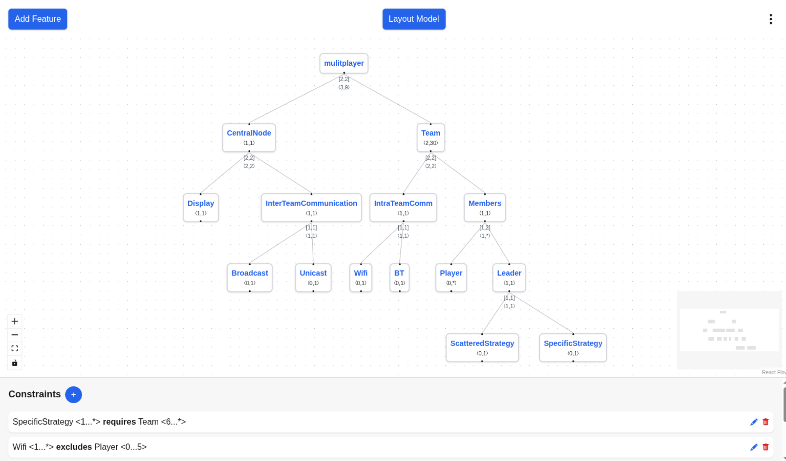

# CFM-Toolbox Webeditor

The CFM-Toolbox Webeditor is a web-based application designed to facilitate the editing of CFMs(Cardinality-Based Feature Models). This tool provides a user-friendly interface to create, modify, and export CFMs. The Webeditor works fully within the browser and can be provided to many users through a single server-side installation. It is integrating features of the [CFM-Toolbox](https://github.com/KIT-TVA/cfmtoolbox), a comprehensive suite for managing and analyzing CFMs.

## Table of Contents
- [Features](#feature-overview)
- [Installation](#installation)
- [Development](#development)

## Feature Overview
- **User-Friendly Interface**: Intuitive design for easy navigation and editing of CFMs: 
- **Import existing CFMs**: Load CFMs from files in various formats, including UVL and JSON.
- **Export CFMs**: Save your edited CFMs in multiple formats for further use or sharing.
  - UVL
  - JSON
  - SVG (for visual representation)
  - PNG (for visual representation)
- **Convert CFMs**: Convert your CFMs between different formats.

### Future extensions
- **CFM Validation**: Ensure the integrity and correctness of your CFMs.

## Installation
The CFM Webeditor can easily be installed and run on any system supporting Docker. 
Simply adapt the following docker-compose file to your needs and run `docker-compose up` in the same directory. 

Make sure to replace `<your IP or hostname>` with the actual IP address or hostname at which the frontend will be accessible/from which requests will be originating. You can supply multiple allowed origins by separating them with commas, e.g. `ALLOWED_ORIGINS: '["http://localhost:3000", "https://yourdomain.com"]'`.

```yaml
services:
  backend:
    image: ghcr.io/kit-tva/cfmtoolbox-webeditor-backend:main
    ports:
      - "3001:8000"
    environment:
      ALLOWED_ORIGINS: '["<your IP or hostname>"]'
  frontend:
    image: ghcr.io/kit-tva/cfmtoolbox-webeditor-frontend:main
    ports:
      - "80:3000"
    depends_on:
      - backend
```

## Development

The CFM-Toolbox Webeditor consists of two main components: the backend and the frontend. Each component can be developed independently and requires a specific development setup.

### Backend
The backend is built using FastAPI and acts as a Wrapper around the [cfm-toolbox](https://github.com/KIT-TVA/cfmtoolbox). If new toolbox features are to be integrated into the webeditor, they need to be added as a new API route.

#### Setting up the Development Environment
To set up the development environment for the backend, follow these steps:
1. **Clone the Repository**: Clone the CFM-Toolbox Webeditor repository to your local machine.
   ```bash
   git clone
   ```
2. **Navigate to the Backend Directory**
3. **Create a Virtual Environment**: Create and activate a virtual environment to manage dependencies.
   ```bash
   python -m venv .venv
   source .venv/bin/activate  # On Windows use `.venv\Scripts\activate`
   ```
4. **Install Dependencies**: Install the required dependencies using pip.
   ```bash
    pip install -r requirements.txt
    ```
5. **Start the Development Server**: Start the FastAPI development server.
   ```bash
   fastapi dev
   ```
You should now be able to access the backend at `http://localhost:8000`.

#### Adding a new API Route
The API routes are defined in `backend/app/main.py`. To add a new route, define a new function and use the appropriate FastAPI decorator (e.g., `@app.post`, `@app.get`) to specify the HTTP method and endpoint.
We try to keep the endpoints organized by toolbox feature. For example, all conversion-related endpoints are grouped together at ``[host]/convert/...``.

You can find all functions used for a group of endpoints in their own module. Functions for the `convert` endpoint are located in `backend/app/converters`.

Use a tool like [Bruno](https://usebruno.com) to test your new endpoint. Make sure to handle errors gracefully and return appropriate HTTP status codes.
Our existing Bruno collection can be found in [./bruno](bruno).

API documentation is generated automatically and is available at `http://localhost:8000/docs` (Swagger UI) and `http://localhost:8000/redoc` (ReDoc).

### Frontend
This is a web-based frontend for creating and editing **Feature Models**, built with [Next.js](https://nextjs.org/) and [React Flow](https://reactflow.dev/).

## Getting Started
1. **Requirements**: 
- Node.js (>= 18)  
- npm (or yarn/pnpm)
1. **Clone the Repository**: Clone the CFM-Toolbox Webeditor repository to your local machine.
   ```bash
   git clone
   ```
2. **Navigate to the Frontend Directory**
3. **Install dependencies**
  ```bash
   npm install
   ```

4. **Run the development server**

  ```bash
   npm run dev
  ```

Open [http://localhost:3000](http://localhost:3000) with your browser to see the result.

You can start editing the page by modifying `app/feature-model-reactflow.tsx`, `app/page.tsx`, updating existing components in `app/components`, or adding new components. The page will automatically refresh as you make changes. All translations and locale configurations are located in the `app/locales` folder. The main styles are defined in `globals.css`, applied throughout the application using TailwindCSS.
